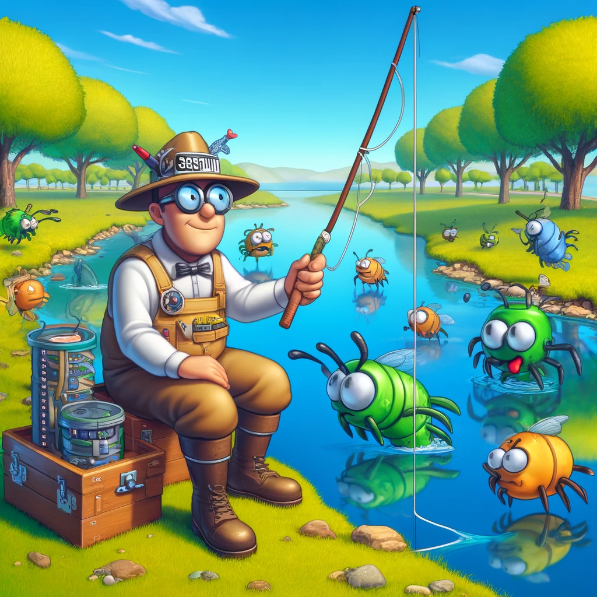

# Fishing bugs Lab



## Overview

Welcome to the Rails Debugging Lab! This lab is designed to enhance your understanding of Ruby on Rails by presenting you with a series of intentionally introduced bugs, issues, and challenges within a pre-built Rails application. Your task is to identify, debug, and fix these issues, applying best practices and reinforcing your knowledge of Rails' structure and operation.

## Objectives

- **Debugging Skills:** Improve your ability to diagnose and fix common Rails errors.
- **Rails Fundamentals:** Deepen your understanding of MVC architecture, routing, migrations, ActiveRecord, and more.
- **Problem-Solving:** Enhance your problem-solving skills in a real-world context.
- **Best Practices:** Learn best practices for writing clean, efficient, and secure Rails code.

## Getting Started

1. **Clone the Repository:**

    ```bash
    git clone git@github.com:Islamsulaiman/fishing_bugs.git
    cd fishing_bugs
    ```

2. **Set Up Your Environment:**

    Make sure you have Ruby, Rails, and Bundler installed. Then, run:

    ```bash
    bundle install
    ```

3. **Database Setup:**

    Run the following commands to set up your database:

    ```bash
    rails db:create
    rails db:migrate
    ```

4. **Start the Rails Server:**

    ```bash
    rails server
    ```

    Visit `http://localhost:3000` in your browser to see the application.


## Guidelines for Completion

- Tackle issues one at a time, starting with those you feel most comfortable with.
- Use Rails documentation, Stack Overflow, and course materials as resources.
- Commit your changes with descriptive messages after resolving each issue.

## Submission

Once you have addressed all the issues:

1. Fork the repository.
2. Clone you're forked repository locally.
3. Create new branch from main to solve in.
4. Solve the issues one by one, and make each solution in a separate commit.
5. Push your changes to your forked repository.
6. Open a PR against the original repository.
7. Include reflections on what you learned during the lab and any feedback on the lab itself inside the PR description.
